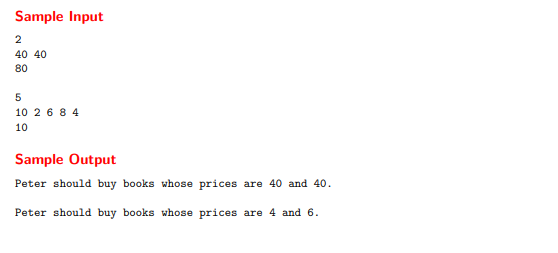
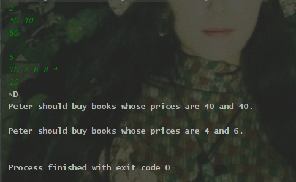
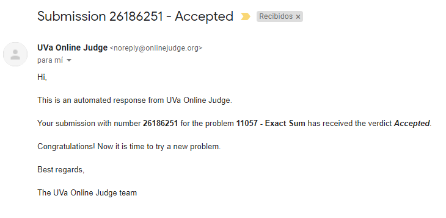

# exact-sum

please, first read the repository's about.

The compiled code is inside out/production/LoginAndUserAccounts since this was made using Intellij Idea.

This is a problem from Online Judge which you can find in : [UVa 11057](https://shorturl.at/mAPXZ)

This was debugged using the input from brainfry713 in : [uDebug UVa 11057](https://www.udebug.com/UVa/11057)

The enunciate was the next: 

Peter received money from his parents this week and wants to spend it all buying books. But he does
not read a book so fast, because he likes to enjoy every single word while he is reading. In this way, it
takes him a week to finish a book.

As Peter receives money every two weeks, he decided to buy two books, then he can read them until
receive more money. As he wishes to spend all the money, he should choose two books whose prices
summed up are equal to the money that he has. It is a little bit difficult to find these books, so Peter
asks your help to find them.

Input

Each test case starts with 2 ≤ N ≤ 10000, the number of available books. Next line will have N
integers, representing the price of each book, a book costs less than 1000001. Then there is another
line with an integer M, representing how much money Peter has. There is a blank line after each test
case. The input is terminated by end of file (EOF).

Output

For each test case you must print the message: ‘Peter should buy books whose prices are i and
j.’, where i and j are the prices of the books whose sum is equal do M and i ≤ j. You can consider that
is always possible to find a solution, if there are multiple solutions print the solution that minimizes
the difference between the prices i and j. After each test case you must print a blank line.

Here's how this input (green) / output (white) looks in this code: 

Also, here's the response after being submitted to online judge: 

